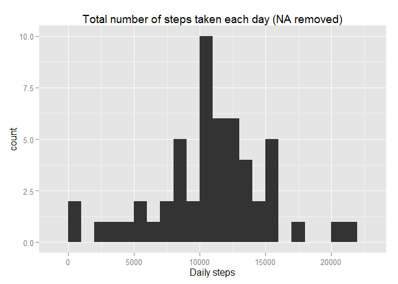
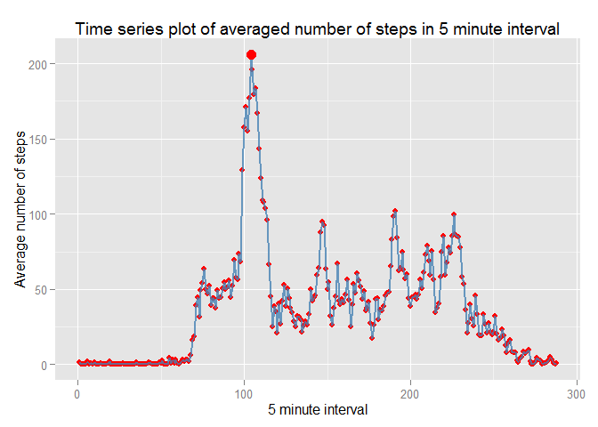
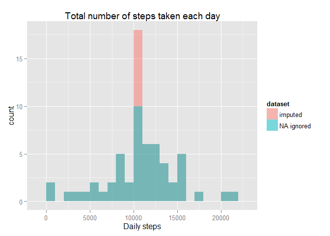
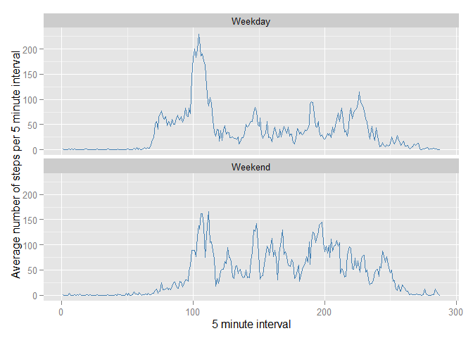

# Reproducible Research: Peer Assessment 1


This assignment makes use of data from a personal activity monitoring device.
This device collects data at 5 minute intervals through out the day.
The data consists of two months of data from an anonymous individual collected
during the months of October and November, 2012 and include the number of steps
taken in 5 minute intervals each day.
<br><br>

## Loading and preprocessing the data
At first, the data should be loaded:

```r
rm(list=ls())
data <- read.csv2("activity.csv", sep = ",")
```
and then the second column is transformed to more appropriate "Date" class:

```r
data[,2] <- as.Date(data[,2],"%Y-%m-%d")
```
<br>


## What is mean total number of steps taken per day?
First the total number of steps taken per day is calculated in the following way:

```r
#remove missing values
temp <- data[!is.na(data$steps),]
#calculate sum of steps per day
stepsPerDay <- tapply(temp$steps, temp$date, sum)
#calcultae mean and median of daily number of steps
meanStepsPerDay <- mean(stepsPerDay)
medianStepsPerDay <- median(stepsPerDay)
```

The resulting total number of steps taken each day is presented as a histogram:

```r
library(ggplot2)
qplot(stepsPerDay,
      main = "Total number of steps taken each day (NA removed)",
      xlab = "Daily steps",
      binwidth = 1000)
```

 

The mean of the total number of steps taken per day is: **10766.19**.  
The median of the total number of steps taken per day: **10765**.


These values are very similar to those obtained by summary function:

```r
summary(stepsPerDay)
```

```
##    Min. 1st Qu.  Median    Mean 3rd Qu.    Max. 
##      41    8840   10800   10800   13300   21200
```
<br>


## What is the average daily activity pattern?
The average number of steps per 5 minute interval can be calculated as follows:

```r
#number of steps per 5 minute interval, averaged across days
meanStepsPerInterval <- tapply(temp$steps, temp$interval, mean)
```

The time series plot can be the constructed using ggplot library:

```r
#create new data frame (first column - index, second column - average value)
totalNumberOfIntPerDay <- 60/5 * 24
dataInterval <- data.frame(interval = 1:totalNumberOfIntPerDay, value=meanStepsPerInterval)
#dataInterval <- data.frame(interval = unique(temp$interval), value=meanStepsPerInterval)

#maximum value of averaged number of steps per 5 minute interval
maxMeanStepsPerInterval <- max(dataInterval$value)

#index of 5 minute interval that has on average the highest number of steps
maxInterval <- with(dataInterval, interval[value== max(value)])

#transform this index to more meaningful time of day
maxHours <- trunc(maxInterval*5/60)
maxMinute <- maxInterval*5 - maxHours*60
#plot results
g <- ggplot(dataInterval, aes(interval, value))
g + geom_point(col = "red", size=2) + 
    geom_line(col="steelblue", size=1, alpha = 0.8) +
    geom_point(aes(x= maxInterval, y = maxMeanStepsPerInterval), color="red", size = 4, alpha = 0.9) +
    labs(x = "5 minute interval") +
    labs(y = "Average number of steps") +
    labs(title = "Time series plot of averaged number of steps in 5 minute interval")
```

 

As can be seen from the plot, the maximum value of averaged number of steps per 5 minute interval is **206** number of steps (rounded) which occurs in **104**th 5 minute interval, which (if the measurements of each day starts at 00:00) corresponds to the time between **8:35** and **8:40**.
<br>


## Imputing missing values
Calculate and report the total number of missing values in the dataset (i.e. the total number of rows with NAs)

```r
noNA <- sum(is.na(data))
```
According to the calculation, the total number of missing values is **2304**. The same result is obtained with summary function

```r
summary(data)
```

```
##      steps           date               interval   
##  Min.   :  0    Min.   :2012-10-01   Min.   :   0  
##  1st Qu.:  0    1st Qu.:2012-10-16   1st Qu.: 589  
##  Median :  0    Median :2012-10-31   Median :1178  
##  Mean   : 37    Mean   :2012-10-31   Mean   :1178  
##  3rd Qu.: 12    3rd Qu.:2012-11-15   3rd Qu.:1766  
##  Max.   :806    Max.   :2012-11-30   Max.   :2355  
##  NA's   :2304
```
The missing values are filled with the appropriate mean value (i.e. average value of that 5 minute interval). 

```r
#copy data frame
dataFilled <- data

#make tempRep variable - average steps per 5 minute interval per day, repeat it for number of days in dataset
tempRep <- rep(meanStepsPerInterval,length(unique(data$date)))

#impute missing values with the mean values of appropriate 5 minute interval
dataFilled[is.na(dataFilled$steps),1] <- tempRep[is.na(dataFilled$steps)]

#calculate sum of steps per day
stepsPerDayFilled <- tapply(dataFilled$steps, dataFilled$date, sum)

#calculate mean and median of daily number of steps
meanStepsPerDayFilled <- mean(stepsPerDayFilled)
medianStepsPerDayFilled <- median(stepsPerDayFilled)

#check that there is no missing values
summary(dataFilled)
```

```
##      steps          date               interval   
##  Min.   :  0   Min.   :2012-10-01   Min.   :   0  
##  1st Qu.:  0   1st Qu.:2012-10-16   1st Qu.: 589  
##  Median :  0   Median :2012-10-31   Median :1178  
##  Mean   : 37   Mean   :2012-10-31   Mean   :1178  
##  3rd Qu.: 27   3rd Qu.:2012-11-15   3rd Qu.:1766  
##  Max.   :806   Max.   :2012-11-30   Max.   :2355
```
Now, with imputed missing variables, the histogram of total numbers of steps take each day look like this:

```r
qplot(stepsPerDayFilled, main = "Total number of steps taken each day", xlab = "Daily steps", binwidth = 1000)
```

 

With the imputed missing variables, the mean of the total number of steps taken per day is **10766.19** while the median of the total number of steps taken per day: **10766.19**. The difference between mean values is **0**, the difference between median values is **-1.19**. The following histogram compares the total number of steps taken each day when NAs are imputed and when they are ignored:

```r
stepsPerDayy <- tapply(data$steps, data$date, sum, na.rm = FALSE)
dat <- data.frame(val = c(stepsPerDayy,stepsPerDayFilled),
                  dataset = factor(rep(c("NA ignored","imputed"),each=length(stepsPerDayy))))

ggplot(dat, aes(x=val, fill=dataset)) +
    geom_histogram(binwidth=1000, alpha=.5, position="identity") +
    labs(x = "Daily steps") +
    labs(title = "Total number of steps taken each day")
```

 
<br>


## Are there differences in activity patterns between weekdays and weekends?
Additional column is added, which classifies the day as *weekday* or *weekend*:

```r
dataFilled$FactorDay <- as.factor(ifelse(weekdays(dataFilled$date)  %in% c("subota","nedjelja"), "Weekend", "Weekday"))
```
Now, the panel plot can be created which has averaged number of steps per 5 minute interval, for both, weekdays and weekend.

```r
averageIntervalDays <- with(dataFilled, tapply(steps, list(interval, FactorDay), mean))
noIntervals <- dim(averageIntervalDays)
dataDays <- data.frame(xint = rep(1:noIntervals[1],2), 
                       stepsDay = c(averageIntervalDays[,1],averageIntervalDays[,2]),
                       factorVar = rep(c("Weekday","Weekend"),each = noIntervals[1]))
ggplot(dataDays, aes(xint, stepsDay)) +
    geom_line(color = "steelblue") +
    facet_wrap(~factorVar, nrow = 2) +
    labs(y = "Average number of steps per 5 minute interval") +
    labs(x = "5 minute interval")
```

 


<br>
